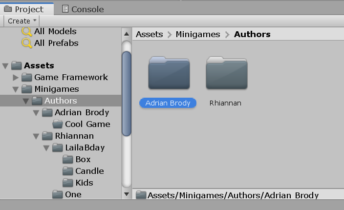
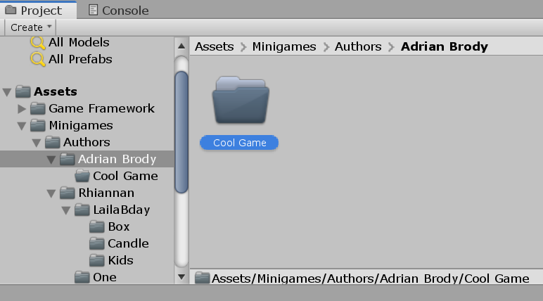
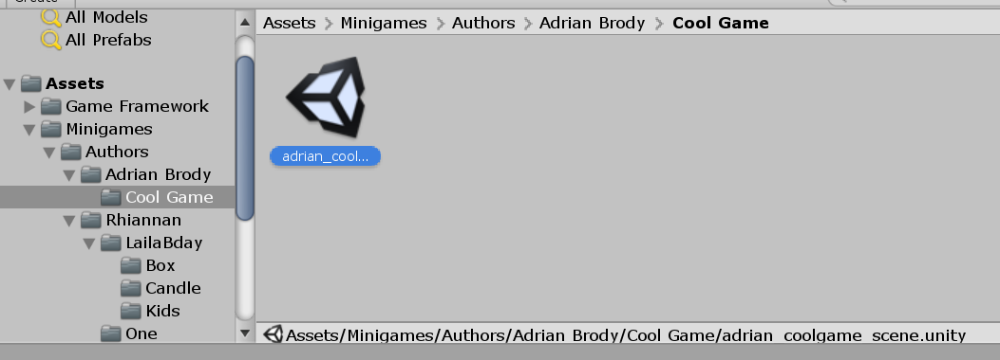
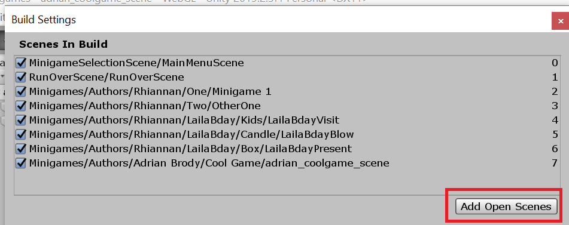
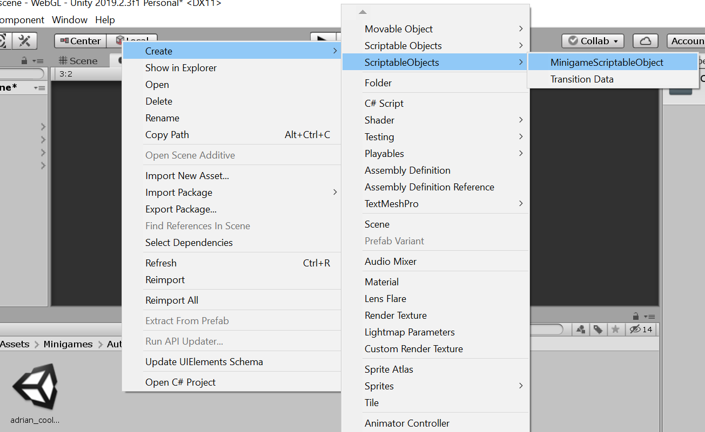
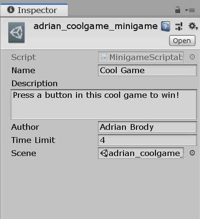
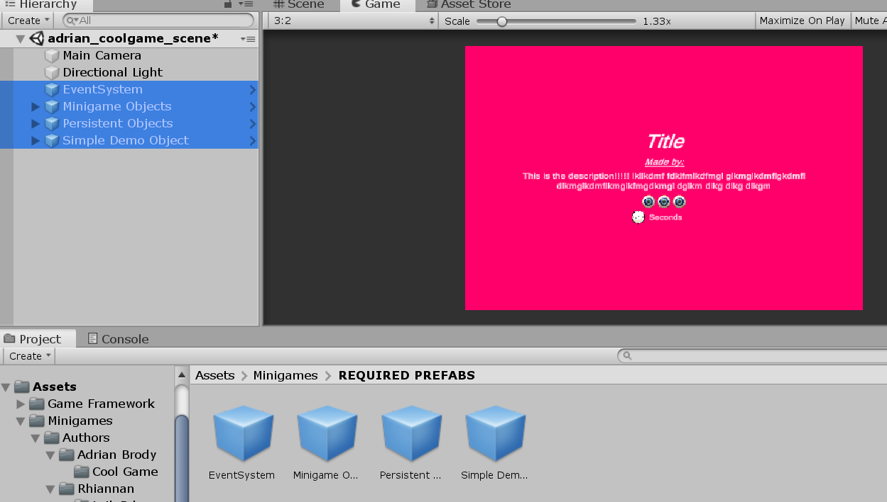

# GameGameGameGame Setup Guide

#### (For poking around game, NOT for if you want to contribute)
1. Download [Unity Hub](https://docs.unity3d.com/Manual/GettingStartedInstallingHub.html)
2. Download [Blender](https://www.blender.org/download/releases/2-80/)
3. __Project Download Options__
    * __For quick setup, if you don't intend on contributing__ Download / Clone this project.
    * __Full setup for contributing__ Fork and clone this project to your desired repository. Guide for that [here](https://akrabat.com/the-beginners-guide-to-contributing-to-a-github-project/).
4. Open / attach this project in Unity Hub. 
5. Download Appropriate version of Unity (Will probably change, but should be fine if you're on 2019.2.X)
6. Open project in Unity
7. Go to Window>Package Manager>TextMesh Pro, and install (basic asset installation should be sufficient)

# Creating a Minigame
### The process is subject to change, but here is the current workflow

1. In the project explorer, go to `Assets/Resources/Minigames/Authors` and create a folder with your name. 

   
2. In your folder, create another folder with the title of your minigame.

   

3. Enter that folder, now, create a Unity scene and name it `author_title_scene`

   

4. Double click on your scene to enter it.
5. Once you’ve entered your scene, go to `File>Build Settings`, and click the button "Add open scenes". This means the scene will actually be included when the game is built.

   

6. Next, in the same folder as your scene, go to `Create> ScriptableObjects>  MinigameScriptableObject`, and name it similar to the scene: `author_title_minigame`.

   

7. With that asset selected, you can see blank values in the inspector, fill those out with your game details.

   

8. Next, locate the folder `Assets/Resources/Minigames/REQUIRED PREFABS`, and drag all of the prefabs into the scene hierarchy.

   

Now, if you click the play button on either your game scene or the minigame select scene, your game should start playing, or be active in the list of playable games. 💃💃💃

## IMPORTANT NOTE:
Because of the way the saving is currently managed, your game will not be updated if a save file already exists. To manage existence of save files, go to Window > Save Settings, and you can delete files / toggle ability to save at all to your heart's content.
